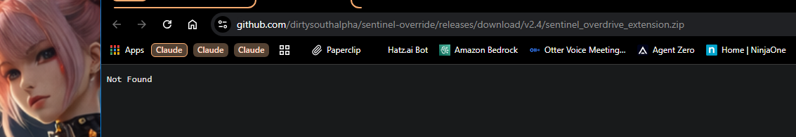
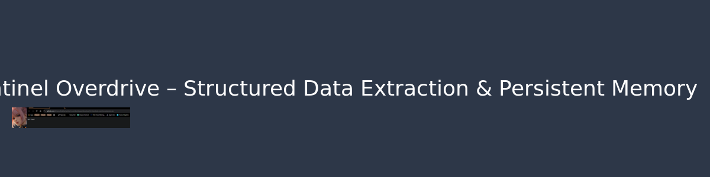

# Sentinel Overdrive

**Sentinel Overdrive – Structured Data Extraction & Persistent Memory**

A browser extension that extracts structured data from web pages and stores it in persistent memory for later use.

## Install
1. Clone the repository or download the latest release.
2. Open Chrome/Edge `chrome://extensions` (enable Developer mode).
3. Click **Load unpacked** and select the repository folder.
4. The extension icon will appear in the toolbar.

## Usage
- Click the extension icon to open the UI.
- Configure extraction rules in the settings panel.
- Extracted data is saved locally and can be exported as JSON.

---
