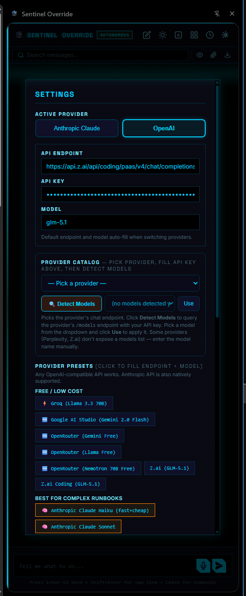
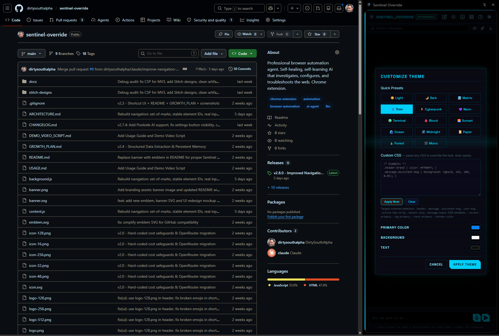

<div align="center">

# ⚡🛡️ Sentinel Override

### Professional AI Browser Automation for IT Pros

A self-healing, self-learning browser agent built for the work technicians actually do — multi-portal investigations, M365 admin, threat hunts, ticket writeups. Watch it click, read, think, and report.


<p>
  <a href="../../releases">Releases</a> •
  <a href="#-quick-start">Quick Start</a> •
  <a href="#-providers">Providers</a> •
  <a href="#-msp-features">MSP Features</a> •
  <a href="#-vs-claude-in-chrome">vs Claude in Chrome</a>
</p>

</div>

---

<p align="center">
  
</p>

> **Sentinel Override turns your browser into an AI operator.** Tell it what to do in plain English and watch a virtual cursor glide across the screen, click buttons, type into fields, and produce defensible, source-cited reports. Every click is approval-gated when you want it to be. Every claim in the report traces back to extracted data. Tenant-lock, MFA-pause, forensic run logs — built for MSP work where being wrong has consequences.

---

## 🎯 What makes it different

**Built for technicians, not demos.** Most browser-agent projects optimize for the launch GIF. Sentinel Override optimizes for what happens at step 47 of an HR investigation across seven M365 admin centers when the page is half-loaded and the model wants to give up. Three years of MSP-pattern audit work is wired into the system prompt and the agent loop.

| | Sentinel Override | Claude in Chrome |
|---|---|---|
| **Bring your own LLM** | 16 providers + custom endpoint | Anthropic only |
| **Tenant lockdown** for M365 admin work | ✅ Hard-block on cross-client mistakes | ❌ |
| **Sensitive-field protection** by label proximity | ✅ Blocks PSK, API key, recovery codes | Limited (password-only) |
| **MFA challenge auto-pause** | ✅ Detects + pauses + chat banner | ❌ |
| **Configuration verification gate** | ✅ Forces re-read before "done" | ❌ |
| **Source-cited outputs** with audit chips | ✅ Every claim → memory key | ❌ |
| **Forensic run log** + JSON/CSV export | ✅ Compliance-grade audit trail | ❌ |
| **Tab group attachment** | ✅ Orange "Sentinel" group glow | ✅ |
| **Per-tab side-panel** | ✅ Hides on unrelated tabs | ✅ |
| **Virtual operator cursor** | ✅ Glides on synthetic AND CDP paths | ✅ |
| **CSV / file download capture** | ✅ Captured in popup chat | ❌ |
| **Resume from checkpoint** | ✅ One-click | ❌ |
| **14 themes + custom CSS** | ✅ Full visual customization | Limited |
| **Hallucination hard-stop gate** | ✅ Counts claims vs evidence | Prompt-only |
| **Multi-portal investigation mode** | ✅ Auto-detects + paces | ❌ |

---

## 📸 Screenshots

<table>
<tr>
<td width="50%" valign="top">

### Command Palette (⌘K)



Cmd/Ctrl + K to fire any of: New Chat, Export Conversation, Clear Search, Toggle Dark Mode, Open Settings, Customize Theme.

</td>
<td width="50%" valign="top">

### 14 Themes + Custom CSS



Light, Dark, Matrix, Tron, Cyberpunk, Neon, Terminal, Blood, Sunset, Ocean, Midnight, Paper, Forest, Mono — auto-saves on click. Plus a Custom CSS textarea for full visual control.

</td>
</tr>
</table>

---

## ⚡ Quick Start

### 1. Install

```bash
# Clone the repo
git clone https://github.com/dirtysouthalpha/sentinel-override.git
```

Then in Chrome:

1. Open `chrome://extensions`
2. Enable **Developer mode** (top right)
3. Click **Load unpacked** and select the cloned folder
4. Pin Sentinel Override to your toolbar

### 2. Connect a provider

Open Settings (⚙️) → **Provider Catalog** → pick a provider → paste API key → click **🔍 Detect Models** → pick a model from the live-fetched list → **Use** → Save.

### 3. Run

Click the toolbar icon to open the side panel. Type what you want done. Watch the orange cursor glide across the page.

```
Pull Amy Hobbs's Entra sign-in events for the last 60 days, identify any
noteworthy patterns, and produce a defensible findings report.
Tenant: acme.onmicrosoft.com
Ticket: #4521
```

---

## 🔌 Providers

16 providers ship in the catalog with one-click model auto-detection. Pick a provider, paste your API key, click **Detect Models**, get a live dropdown of every model the provider exposes.

<table>
<tr>
<th>Provider</th>
<th>Models endpoint</th>
<th>Notes</th>
</tr>
<tr><td><strong>OpenAI</strong></td><td>✅ auto-detect</td><td>gpt-5, gpt-4.1, gpt-4o, o4-mini, o3</td></tr>
<tr><td><strong>Anthropic Claude</strong></td><td>✅ auto-detect</td><td>opus-4-6, sonnet-4-6, haiku-4-5</td></tr>
<tr><td><strong>Google Gemini</strong></td><td>✅ auto-detect</td><td>gemini-2.5-pro, 2.5-flash</td></tr>
<tr><td><strong>xAI Grok</strong></td><td>✅ auto-detect</td><td>grok-4 family</td></tr>
<tr><td><strong>DeepSeek</strong></td><td>✅ auto-detect</td><td>chat, reasoner</td></tr>
<tr><td><strong>OpenRouter</strong></td><td>✅ auto-detect</td><td>200+ models, any provider</td></tr>
<tr><td><strong>Groq</strong></td><td>✅ auto-detect</td><td>Llama, Mixtral, fastest inference</td></tr>
<tr><td><strong>Mistral AI</strong></td><td>✅ auto-detect</td><td>large, codestral</td></tr>
<tr><td><strong>Together AI</strong></td><td>✅ auto-detect</td><td>open-source models hosted</td></tr>
<tr><td><strong>Fireworks AI</strong></td><td>✅ auto-detect</td><td>Llama, Mixtral, fast</td></tr>
<tr><td><strong>Cerebras</strong></td><td>✅ auto-detect</td><td>fastest open-model inference</td></tr>
<tr><td><strong>Perplexity</strong></td><td>—</td><td>sonar-large (manual model entry)</td></tr>
<tr><td><strong>Z.ai (GLM)</strong></td><td>—</td><td>glm-5.1 (manual model entry)</td></tr>
<tr><td><strong>Ollama</strong> (local)</td><td>✅ auto-detect</td><td>your local models</td></tr>
<tr><td><strong>LM Studio</strong> (local)</td><td>✅ auto-detect</td><td>your local models</td></tr>
<tr><td><strong>Custom</strong></td><td>✅ auto-detect</td><td>any OpenAI-compatible endpoint (vLLM, LiteLLM, etc.)</td></tr>
</table>

---

## 🛡️ MSP Features

### Tenant Lockdown

Set `expectedTenant` in Settings to your client's tenant (e.g., `acme.onmicrosoft.com`). The popup header shows a tenant chip — green when it matches, red and pulsing when it doesn't. **Modifying actions on Microsoft admin URLs are HARD-BLOCKED** when the detected tenant doesn't match. A red **CROSS-TENANT ACTION BLOCKED** card appears requiring an explicit *"Yes — intentional cross-tenant work"* click. Every override is timestamped and logged to the forensic run log for compliance review.

### Sensitive-field protection

Pre-shared keys, API keys, recovery codes, SSN, credit-card numbers, CVV, account numbers — all blocked by **label proximity**, not just `type=password`. The agent walks up to 3 ancestors and previous siblings, scans for sensitive label patterns, and refuses to type. Protects both synthetic and CDP trusted-input paths.

### MFA challenge auto-pause

Detects 12 patterns of step-up authentication (`verify your identity`, `enter the code`, `approve sign-in`, `6-digit code`, `authenticator app`, `OTP`, etc.). When fired: agent pauses, desktop notification appears, popup shows a Resume banner. Walks-away-safe (90-second fail-closed timeout for tenant-override decisions, never silent approval).

### Configuration verification gate

When the goal contains change verbs (`add`, `create`, `delete`, `modify`, `update`, `enable`, `disable`, `block`, `allow`, `configure`, `grant`, `revoke`, `assign`, `remove`, `change`) on a known config platform (firewall, M365 admin, RMM, etc.), `finish` is BLOCKED until (a) a Save/Apply/Commit click happened in the last 12 history entries AND (b) a follow-up read confirms the change. Stops false-positive "ticket done" outcomes cold.

### Source-cited outputs (auditability)

Every specific claim in a finish summary — numbers, dates, statistics, named quotes, IPs, dollar amounts — must end with `[src:memory_key]` referencing the `agentMemory` entry it was extracted from. Untagged claims tagged `[unverified]` and moved to a Caveats section. **In the popup, those tags become clickable orange chips** that expand the underlying source data inline. Click `🔖 entra_signins` and see the actual JSON the claim came from.

### Forensic run log + export

Every run produces a per-step structured log: timestamp, URL, tenant, action type, selector/ref, text preview (truncated for sensitive values), result, failed flag, plus tenant-override events (`requested` / `granted` / `denied`). After the run finishes, a banner appears: **Export JSON** or **Export CSV** — RFC-4180 quoted, 10-column flat table ready for ticket attachment. Defensibility tier-up for HR/legal/compliance work.

### Multi-portal investigation mode

Detects when a goal mentions ≥ 2 admin centers (Entra + Exchange + Purview + OneDrive + Teams + Intune + Defender + M365 + Azure + SentinelOne + ConnectWise + NinjaOne + Datto + IT Glue + Huntress). Step budget extends from 100 baseline to up to 300, with +50 head-start. Findings auto-prefix with portal name (`entra_signins`, `purview_audit_search`, etc.) so the report sections cleanly. Periodic progress checkpoints every 25 steps so you see motion on long runs.

### Microsoft Graph API extraction strategy

When DOM extraction fails on M365 admin centers (cross-origin sandbox iframes block scraping), the system prompt tells the LLM to call `read_network_requests` with `url_includes: 'graph.microsoft.com|graphbeta'` to read the underlying JSON the UI is rendering. Common Graph paths documented for Entra sign-ins, audit logs, mailbox audit, Defender alerts, Intune devices, OneDrive activity, SharePoint, Teams call records.

### Hallucination hard-stop

Counts distinct claims in the proposed finish summary (numbered list entries, table rows, bullets, specific numbers/dates/percentages) vs evidence sources (memory keys + notes + source tags). Triggers when claim density wildly exceeds evidence and no caveat phrases are present. Forces a re-write that either trims to verified items or tags unread items explicitly.

### Resume from checkpoint

Every step writes a checkpoint to `chrome.storage.session`. If the popup re-opens within an hour and the agent isn't running, an orange **Resume previous run?** banner appears with a 200-char preview of the goal. One click resumes — `agent_memory` carries forward.

---

## 🎨 Themes & Custom CSS

14 built-in themes:

`☀️ Light` `🌙 Dark` `💻 Matrix` `🔷 Tron` `⚡ Cyberpunk` `💜 Neon` `🟢 Terminal` `🩸 Blood` `🌅 Sunset` `🌊 Ocean` `🌌 Midnight` `📜 Paper` `🌲 Forest` `⬛ Mono`

Auto-save on click. Picks one strip prior `theme-*` classes first so themes never accidentally stack.

**Custom CSS textarea** lives in the theme modal. Paste any CSS, auto-saves on edit (350ms debounce), applies via `<style id="sentinel-custom-css">` injected into the popup head. Persists across browser restarts. Helpful CSS variable + selector reference below the textarea.

---

## 👁️ Visual feedback

A virtual orange operator cursor glides to every action target before the click fires — on **both** synthetic-events AND CDP trusted-input paths. Element gets the orange highlight. Click pulse expands outward. Banner shows what's happening. Cursor halo shrinks and tints red on press. SPA reconciliation can't kill the cursor (attached to `documentElement`, MutationObserver re-creates if pruned, max-int z-index + `isolation: isolate` so M365's stacking contexts can't bury it).

The popup itself shows:

- **Active Tab Strip** at top of chat — favicon, hostname, page title, `STEP N/M` badge, plain-English live action with color coding (blue = clicking, yellow = typing, red = blocked), Focus button to bring the agent's tab to front
- **Live mini-screenshot panel** — collapsible thumbnail of the latest observation
- **Tenant chip** in header — auto-detected from `tid=`, `*.onmicrosoft.com`, or page tenant picker
- **Action cards per step** with target text, typed values, and result
- **Tab group glow** — Chrome shows an orange `Sentinel` group label above all tabs the agent touches

---

## 🚀 Usage examples

### Multi-portal HR/compliance investigation

```
EXECUTION MODE: Run live. Do not describe — execute.
Tenant: acme.onmicrosoft.com
Ticket: #1132690

Investigate possible second-job activity for Amy Hobbs (ahobbs@example.com)
over the last 60 days across Entra ID sign-in logs and Microsoft Purview /
Unified Audit Log only.

Output: defensible findings report with timestamps, IPs, event IDs only.
No speculation. Tag unread items as [headline only — not read in this run].
```

### Threat hunt across SentinelOne

```
Hunt SentinelOne for SHA1 d548d72837175752fe5b563690049066ac93fdf5 across
all endpoints. Report: total matches, affected machines, current status.
Ticket: #1132535
```

### SonicWall VPN tunnel add

```
Add a Site-to-Site VPN tunnel on the SonicWall at https://203.0.113.5
Policy name: acme-vpn
Peer IP: 198.51.100.10
PSK: [MISSING DATA — pull from password manager]
Local network: 192.168.1.0/24
Remote network: 192.168.50.0/24
Ciphers: AES-256, SHA-256
Mode: APPROVAL — pause for approval before each click.
```

### Top-N research with honest tagging

```
Give me a briefing on the top 10 articles on drudgereport. For articles
you don't have budget to read in full, list headline + URL only and tag
[headline only — not read in this run]. No fabricated descriptions.
```

---

## 📚 Architecture

```
sentinel-override/
├── background/                     # Service worker (MV3 module)
│   ├── index.js                    # Entry, message routing, downloads, sidePanel visibility
│   ├── agent-engine.js             # Agent loop, hallucination gate, tenant lockdown,
│   │                                  forensic log, dynamic step budget
│   ├── llm-client.js               # 16-provider LLM abstraction, system prompt,
│   │                                  per-platform context, multi-portal directive
│   ├── tab-manager.js              # CDP attach, screenshot, console/network buffers,
│   │                                  trusted-input dispatch
│   ├── tab-context.js              # Per-tab state, group attachment
│   ├── frame-router.js             # Cross-origin iframe routing
│   ├── message-protocol.js         # Typed messaging helpers
│   ├── provider-registry.js        # 16-provider catalog + fetchModelsList
│   ├── scheduler.js                # chrome.alarms scheduling
│   ├── template-manager.js         # Template CRUD
│   ├── collaboration.js            # Import/export
│   ├── report-generator.js         # Final-report rendering
│   └── shared-state.js             # SPA transition flag
├── content/                        # Content scripts (auto-injected per tab)
│   ├── index.js                    # Action executor, sensitive-field block,
│   │                                  MFA detection, tenant detection
│   ├── cursor.js                   # Virtual operator cursor (3.6.0+)
│   ├── dom-utils.js                # ref-id system, bbox emission, scanner
│   ├── shadow-dom.js               # queryDeep / queryDeepFirst piercing
│   ├── dropdown-utils.js           # Custom-dropdown, traverse-nested-menu
│   ├── special-inputs.js           # Date pickers, rich text editors, file upload
│   ├── overlay-detector.js         # Modal/cookie-banner dismissal (conservative)
│   ├── frame-manager.js            # Same-origin iframe scanning
│   ├── highlight.js                # Element highlight (CSS class injection)
│   ├── wait-utils.js               # Layout-stability waits
│   └── shadow-intercept.js         # Document_start MAIN-world shadow patch
├── popup-modules/                  # Side-panel UI
│   ├── chat.js                     # Goal input, action cards, tenant chip,
│   │                                  active-tab strip, mini-shot, source chips,
│   │                                  forensic log export, MFA banner,
│   │                                  tenant override card
│   ├── settings.js                 # Provider catalog wiring, model auto-detect,
│   │                                  theme auto-save, custom CSS, tenant input
│   ├── templates.js                # Template library
│   ├── scheduler-ui.js             # Schedule management
│   ├── collaboration.js            # Import/export
│   ├── popup-state.js              # Reactive state
│   ├── helpers.js                  # Shared
│   └── ui-common.js                # Shared utilities
├── popup.html                      # Side-panel entry
├── popup.css                       # 14 themes + custom CSS hooks
├── popup-full.js                   # Bootstrap
├── manifest.json                   # MV3 manifest
└── docs/                           # Audit docs + screenshots
```

---

## 🎬 Action reference

| Action | Description |
|---|---|
| `click` / `click_at` | Click an element by selector/ref or by (x,y) |
| `type` | Type into a field — sensitive-field-blocked |
| `navigate` | Navigate to a URL |
| `scroll` / `scroll_to` | Scroll viewport or to a specific element |
| `select` | Native or custom dropdown |
| `check` / `check_all` | Set checkbox/radio state |
| `hover` | Pointer + mouse hover (Radix/Headless UI compatible) |
| `press_key` | Enter, Tab, Esc, Arrow*, modifiers |
| `extract` / `extract_list` | Pull data from page to memory |
| `execute_js` | Run JavaScript via CDP `Runtime.evaluate` (CSP-bypass) |
| `read_page` | Re-read page content |
| `read_console_messages` | Buffered browser console — ✨ great for diagnosing M365 / OAuth |
| `read_network_requests` | Buffered network — ✨ key for shadow-DOM extraction via the underlying API |
| `note` | Record findings |
| `wait_for_text` / `wait_for_element` / `wait_for_navigation` | Poll until condition |
| `open_tab` / `switch_tab` / `close_tab` | Multi-tab orchestration (10-tab limit) |
| `dismiss_overlay` | Conservative cookie/modal dismissal |
| `switch_to_frame` | Same-origin iframe |
| `open_dropdown` | Open + return option list |
| `upload_file` | DataTransfer-based file upload |
| `finish` | Complete with structured summary (auto-formatted to FINAL_NOTES on ticket goals) |

---

## 🔐 Security & safety

- API keys stored in `chrome.storage.local`, never sent anywhere except your configured endpoint
- `execute_js` runs in MAIN world via CDP `Runtime.evaluate` (bypasses page CSP), with approval-mode gating
- Approval mode defaults **ON** for new installs
- Auto-approve timeout REJECTS after 60s (never silent approval)
- Sensitive fields blocked at content-script level by label proximity
- Cross-tenant modifying actions hard-blocked with separate override card
- All page content sent to LLM wrapped in `<UNTRUSTED_PAGE_CONTENT>` tags with explicit instruction-defense
- Goal text scrubbed of IPs/emails/ticket numbers before persistence to learned patterns
- Per-tab side panel visibility — panel hides on unrelated tabs during a run
- Forensic run log captures every action, override, and result with timestamps
- No telemetry, no third-party analytics, no data exfiltration paths

---

## 🤝 Contributing

PRs welcome. Please:

1. Fork the repository
2. Create a feature branch (`git checkout -b feature/your-thing`)
3. Run `node --check` on every modified `.js` file before pushing
4. Test in Chrome with `chrome://extensions` reload
5. Open a Pull Request with a clear description

For architecture deep-dives, see [`docs/`](docs/) — audit docs, MSP task playbooks, visual-feedback design notes.

---

## 📜 License

MIT — see [LICENSE](LICENSE).

---

## ☕ Support

If this saves you a billable hour, consider [buying me a coffee](https://buymeacoffee.com/dirtysouthalpha).

---

<div align="center">

Built with ⚡ by [Dirtysouthalpha](https://github.com/dirtysouthalpha) — **for the techs in the trenches**

</div>
