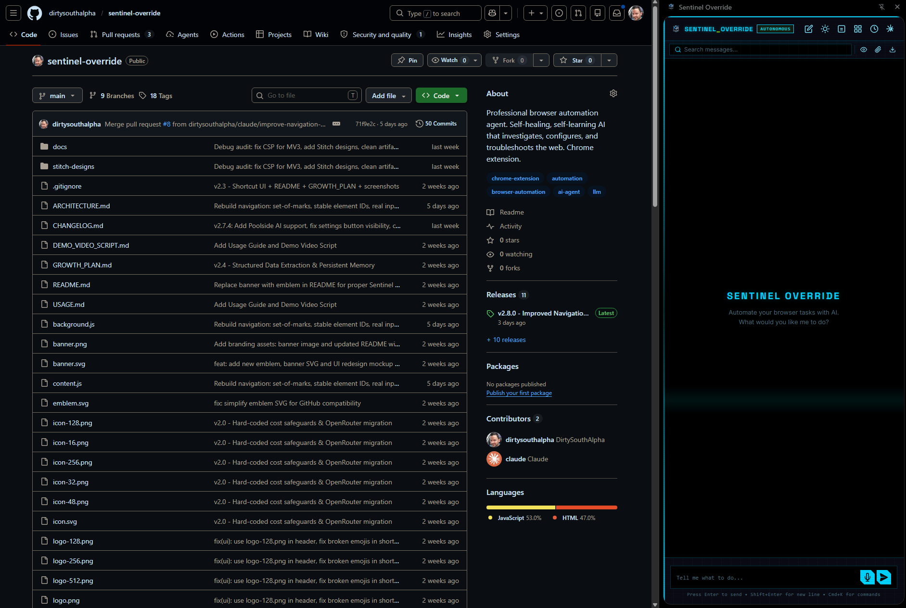

<div align="center">

```
  ██████╗ ██╗   ██╗███████╗██████╗ ██████╗ ██╗██████╗ ███████╗
  ██╔══██╗██║   ██║██╔════╝██╔══██╗██╔══██╗██║██╔══██╗██╔════╝
  ██║  ██║██║   ██║█████╗  ██████╔╝██████╔╝██║██║  ██║█████╗
  ██║  ██║██║   ██║██╔══╝  ██╔══██╗██╔══██╗██║██║  ██║██╔══╝
  ██████╔╝╚██████╔╝███████╗██║  ██║██║  ██║██║██████╔╝███████╗
  ╚═════╝  ╚═════╝ ╚══════╝╚═╝  ╚═╝╚═╝  ╚═╝╚═╝╚═════╝ ╚══════╝

    ██████╗ ██╗   ██╗███████╗██████╗ ██████╗ ██╗██████╗ ███████╗
   ██╔═══██╗██║   ██║██╔════╝██╔══██╗██╔══██╗██║██╔══██╗██╔════╝
   ██║   ██║██║   ██║█████╗  ██████╔╝██████╔╝██║██║  ██║█████╗
   ██║   ██║╚██╗ ██╔╝██╔══╝  ██╔══██╗██╔══██╗██║██║  ██║██╔══╝
   ╚██████╔╝ ╚████╔╝ ███████╗██║  ██║██║  ██║██║██████╔╝███████╗
    ╚═════╝   ╚═══╝  ╚══════╝╚═╝  ╚═╝╚═╝  ╚═╝╚═╝╚═════╝ ╚══════╝

                v19.0.0 — Full-Visibility AI Browser Operator
```

### Professional AI Browser Automation for IT Pros & MSPs

A self-healing, vision-powered browser agent built for the work technicians actually do —
multi-portal investigations, M365 admin, threat hunts, ticket writeups. Watch it see,
click, read, think, and produce defensible reports.


<p>
  <a href="#-whats-new-in-v190">What's New</a> •
  <a href="#-quick-start">Quick Start</a> •
  <a href="#-providers">Providers</a> •
  <a href="#-msp-features">MSP Features</a> •
  <a href="#-vs-claude-in-chrome">vs Claude in Chrome</a> •
  <a href="#-platform-profiles">Platform Profiles</a>
</p>

</div>

---

<p align="center">
  
</p>

> **Sentinel Override turns your browser into an AI operator.** Tell it what to do in plain English and watch a vision-powered agent see the page, place numbered overlays on every clickable element, reason about which one to interact with, and execute — precisely. Every action is traced. Every claim in the report is source-cited. Tenant-lock, MFA-pause, forensic run logs — built for MSP work where being wrong has consequences.

---

## ⚡ What's New in v19.0

### v16–v17 — Foundation & Developer Velocity

- **Plugin system** — install, uninstall, toggle, and conflict-detect plugins via manifest URL. Plugin registry UI in settings modal.
- **Settings export/import** — JSON-based config backup with versioned schema. One-click export, file-picker import.
- **WebSocket bridge hardening** — challenge-response auth (SHA-256), 1MB message limit, type whitelist, exponential backoff reconnect with jitter.
- **Error recovery system** — `AgentError` with 15 error codes, auto-retry with exponential backoff (2s/4s/8s, 3 attempts), error cards in chat with collapsible details and retry button.
- **Platform profile smoke tests** — 8 tests covering all 19 profiles.
- **42 new agent tests** — planning (7), security (16), reporting (10), recovery (5).

### v18–v19 — Test Coverage & Security Hardening

- **8,313 tests passing, 0 failures** across 164 suites.
- **No hardcoded secrets** — WS bridge auth token generated randomly on install, stored in `chrome.storage.local`.
- **No external network dependencies** — Inter and Space Grotesk fonts bundled locally (no Google Fonts CDN).
- **Tightened CSP** — `style-src 'self'` only, no external font/style origins.
- **PII-free codebase** — no personal information in source, tests, or docs.
- **Production build** — 125 files, 1.66 MB zip, debug-stripped, ready for Chrome Web Store.

### Previous Highlights

The agent now **narrates what it sees** in real time. Every observation produces a human-readable status line — not just internal state, but a plain-English description of the page, the form fields detected, the buttons available, and the login state. You always know what the agent is looking at.

**API Health Heartbeat** — a colored indicator (green/yellow/red) in the side panel tracks provider endpoint health in real time. Latency spikes, rate limits, and outages surface immediately — no silent failures.

**Reasoning Cards** — every LLM thinking step renders as a collapsible card in the chat stream. Expand to see the full chain-of-thought; collapse to keep the view clean. Full transparency into why the agent chose its next action.

### Phase 5 — P1: Reliability & Fallbacks

**Screenshot Capture + Preview** — every observation captures a live viewport screenshot displayed in a collapsible preview panel. See exactly what the agent saw at each step. No guesswork.

**Post-Action Verification** — after every click, type, or navigation, the agent automatically re-reads the page to confirm the action took effect. If the verification check fails, the agent retries with adjusted selectors. Self-correcting execution.

**Coordinate-Based Fallback** — when all selector strategies fail (dynamic classes, shadow DOM, iframe sandboxes), the agent falls back to CDP `Input.dispatchMouseEvent` with raw (x,y) coordinates extracted from the last SoM screenshot. Clicks land even on the most hostile SPA layouts.

### Phase 6–7 — P2: User Control & Transparency

**Plan Preview** — before execution starts, the agent renders a step-by-step plan of what it intends to do. Review it, approve it, or edit the goal to redirect. No more blind launches.

**Page State Narration** — the agent describes the current page in structured terms: form fields present, buttons available, login/logout state detected, modal dialogs blocking. Critical for M365 admin work where page state determines what's possible.

**Natural Language Correction** — mid-run adjustments in plain English. Type "click the second tab instead" or "skip this step" while the agent is running. No pause-and-restart — the agent incorporates the correction on the next loop.

### Phase 7–8 — P3: Intelligence & Analytics

**Confidence Scoring** — every action gets a 0–100 confidence score based on selector match quality, element visibility, page stability, and historical success rate. Low-confidence actions surface a warning banner before execution.

**Learned Patterns Dashboard** — tracks success rates for action types across domains. See which selectors work, which sites need CDP fallback, and where the agent self-heals most often. Data-driven reliability insights.

**Client Knowledge Visibility** — the fact count for the current client displays in the sidebar. See how many accumulated wisdom entries are being injected into the system prompt before each run.

**Multi-Provider Strategy** — configure light, default, and heavy model tiers with automatic routing. Simple tasks go to the fast/cheap model; complex reasoning escalates to the heavy model. Cost tracking shows spend per run, per tier.

### Phase 6–8 — P4: Visual & Reporting

**Visual Element Matching** — describe elements by visual appearance ("the blue button in the top-right") instead of selector syntax. The agent matches descriptions to SoM screenshot regions.

**Zoom & Inspect** — click-to-zoom on any screenshot in the run history. Full-resolution inspection of the page state at each step.

**Run Replay & Sharing** — export any completed run as a self-contained HTML report with step-by-step screenshots, actions, and results. Share with teammates, attach to tickets, archive for compliance.

**Desktop Notifications** — native OS notifications for run completion, MFA challenges, errors, and key milestones. Minimize the side panel and still stay informed.

### Stability & Test Coverage

- **164 test suites, 8,313 tests passing** — zero failures
- **No hardcoded secrets, no external CDN dependencies**
- **19 platform profiles with smoke test coverage**
- **700+ commits and counting**

### What else is new

| Feature | Since |
|---|---|
| Vision-first SoM overlays | v4.0 |
| Structured tool-use output (Anthropic + OpenAI) | v4.0 |
| Index-based actions — no selector required | v4.0 |
| Speed modes: Turbo / Normal / Stealth | v4.0 |
| Keyboard shortcuts (Ctrl+Shift+Space / P) | v4.0 |
| Live Status Narration | v15.0 |
| API Health Heartbeat | v15.0 |
| Reasoning Cards (collapsible thinking) | v15.0 |
| Screenshot Capture + Preview | v15.0 |
| Post-Action Verification + auto-retry | v15.0 |
| Coordinate-Based Fallback (CDP clicking) | v15.0 |
| Plan Preview (pre-execution step list) | v15.0 |
| Page State Narration | v15.0 |
| Natural Language Correction (mid-run) | v15.0 |
| Confidence Scoring (0–100 per action) | v15.0 |
| Learned Patterns Dashboard | v15.0 |
| Client Knowledge Visibility | v15.0 |
| Multi-Provider Strategy (light/default/heavy) | v15.0 |
| Visual Element Matching | v15.0 |
| Zoom & Inspect (click-to-zoom screenshots) | v15.0 |
| Run Replay & Sharing (HTML export) | v15.0 |
| Desktop Notifications | v15.0 |
| Adaptive Prompts (platform-aware goal rewriting) | v3.15 |
| Client Knowledge (per-client persistent memory) | v3.12 |
| Quick Assist inline panel | v3.46 |
| Action HUD (real-time on-page step counter) | v3.x |
| Macro Recorder (record + replay action sequences) | v3.x |
| Trust Score (0–100 run quality score) | v3.30 |
| Page Monitor (DOM change detection) | v3.x |
| 19 platform-specific adaptive profiles | v3.x |
| Telemetry panel + recent chats + onboarding | v3.x |

---

## 🎯 vs Claude in Chrome

| | Sentinel Override | Claude in Chrome |
|---|---|---|
| **Bring your own LLM** | 16 providers + custom endpoint | Anthropic only |
| **Vision-first SoM architecture** | ✅ Numbered overlays, index-based actions | ✅ Computer Use |
| **Live Status Narration** | ✅ Agent narrates what it sees in real time | ❌ |
| **API Health Monitor** | ✅ Colored heartbeat indicator | ❌ |
| **Confidence Scoring** | ✅ 0–100 per action | ❌ |
| **Run Replay** | ✅ Export HTML reports with screenshots | ❌ |
| **Plan Preview** | ✅ See steps before execution | ❌ |
| **Mid-run Corrections** | ✅ Natural language adjustments during run | ❌ |
| **Tenant lockdown** for M365 admin work | ✅ Hard-block, cross-client guard | ❌ |
| **Sensitive-field protection** by label proximity | ✅ PSK, API keys, recovery codes, SSN | Limited (password-only) |
| **MFA challenge auto-pause** | ✅ 12 patterns + resume banner | ❌ |
| **Configuration verification gate** | ✅ Forces re-read before "done" | ❌ |
| **Source-cited outputs** with audit chips | ✅ Every claim → clickable memory key | ❌ |
| **Forensic run log** + JSON/CSV export | ✅ Compliance-grade audit trail | ❌ |
| **Adaptive Prompts** (platform-aware goal rewriting) | ✅ 19 platform profiles | ❌ |
| **Client Knowledge** (cross-run persistent memory) | ✅ Compounds across sessions | ❌ |
| **Quick Assist** inline AI panel | ✅ Highlight text → 6 AI actions | ❌ |
| **Macro Recorder** (record + replay) | ✅ | ❌ |
| **Trust Score** (0–100 run quality) | ✅ With breakdown | ❌ |
| **Speed modes** (Turbo / Normal / Stealth) | ✅ | ❌ |
| **Multi-portal investigation mode** | ✅ Auto-detects, extends budget | ❌ |
| **Resume from checkpoint** | ✅ One-click | ❌ |
| **14 themes + custom CSS** | ✅ Full visual customization | Limited |
| **Hallucination hard-stop gate** | ✅ Claim vs evidence count | Prompt-only |
| **Pause / resume mid-run** | ✅ State preserved | ❌ |
| **Step progress counter** | ✅ Live STEP X/MAX | Limited |
| **Tab group glow** | ✅ Orange "Sentinel" group | ✅ |
| **Self-healing selectors** | ✅ Case-insensitive, partial-match, SoM fallback | ❌ |

---

## ⚡ Quick Start

### Install from Chrome Web Store

> _Link coming soon — pending store review._

### Manual Install (Developer Mode)

```bash
git clone https://github.com/dirtysouthalpha/sentinel-override.git
cd sentinel-override
```

Then in Chrome:

1. Open `chrome://extensions`
2. Enable **Developer mode** (toggle, top right)
3. Click **Load unpacked** — select the cloned folder
4. Pin Sentinel Override to your toolbar

### Connect a Provider

Open the side panel → **Settings** (⚙️) → **Provider Catalog** → pick a provider → paste your API key → **🔍 Detect Models** → pick a model from the live-fetched dropdown → **Use** → **Save**.

No restart required. The agent picks up the new provider immediately.

### Run Your First Goal

Click the toolbar icon (or `Ctrl+Shift+Space`) to open the side panel. Type your goal and hit Enter.

```
Pull Amy Hobbs's Entra sign-in events for the last 60 days, identify any
noteworthy patterns, and produce a defensible findings report.
Tenant: acme.onmicrosoft.com
Ticket: #4521
```

Watch the orange cursor glide. Watch the step counter tick. Watch the report materialize with clickable source chips.

---

## 🔌 Providers

16 providers in the catalog with one-click model auto-detection. Paste your key, click **Detect Models**, get a live dropdown of everything the provider exposes.

<table>
<tr><th>Provider</th><th>Models Endpoint</th><th>Notable Models</th></tr>
<tr><td><strong>OpenAI</strong></td><td>✅ auto-detect</td><td>gpt-5, gpt-4.1, gpt-4o, o4-mini, o3</td></tr>
<tr><td><strong>Anthropic Claude</strong></td><td>✅ auto-detect</td><td>claude-opus-4, claude-sonnet-4-6, claude-haiku-4-5</td></tr>
<tr><td><strong>Google Gemini</strong></td><td>✅ auto-detect</td><td>gemini-2.5-pro, gemini-2.5-flash</td></tr>
<tr><td><strong>xAI Grok</strong></td><td>✅ auto-detect</td><td>grok-4 family</td></tr>
<tr><td><strong>DeepSeek</strong></td><td>✅ auto-detect</td><td>deepseek-chat, deepseek-reasoner</td></tr>
<tr><td><strong>OpenRouter</strong></td><td>✅ auto-detect</td><td>200+ models from any provider</td></tr>
<tr><td><strong>Groq</strong></td><td>✅ auto-detect</td><td>Llama 3.3 70B, fastest inference</td></tr>
<tr><td><strong>Mistral AI</strong></td><td>✅ auto-detect</td><td>mistral-large, codestral</td></tr>
<tr><td><strong>Together AI</strong></td><td>✅ auto-detect</td><td>Llama 3.3 70B, Mixtral</td></tr>
<tr><td><strong>Fireworks AI</strong></td><td>✅ auto-detect</td><td>Llama, Mixtral — fast hosted</td></tr>
<tr><td><strong>Cerebras</strong></td><td>✅ auto-detect</td><td>Llama 3.3 70B — fastest open inference</td></tr>
<tr><td><strong>Perplexity</strong></td><td>—</td><td>sonar-large (manual model entry)</td></tr>
<tr><td><strong>Z.ai (GLM)</strong></td><td>✅ auto-detect</td><td>glm-5, glm-5.1, glm-4.7</td></tr>
<tr><td><strong>Ollama</strong> (local)</td><td>✅ auto-detect</td><td>your local models, zero cost</td></tr>
<tr><td><strong>LM Studio</strong> (local)</td><td>✅ auto-detect</td><td>your local models, zero cost</td></tr>
<tr><td><strong>Custom</strong></td><td>✅ auto-detect</td><td>any OpenAI-compatible endpoint — vLLM, LiteLLM, etc.</td></tr>
</table>

Provider resolution is endpoint-based — `api.anthropic.com` gets Anthropic message format; everything else gets OpenAI chat completions format. No configuration flag needed.

**Vision support** is tracked per model. The registry knows which models can receive screenshots and which can't — with per-model overrides for GLM, Qwen, Gemini, and all Claude 3+ variants. Vision-capable models get the SoM screenshot; text-only models get the DOM tree.

---

## 🛡️ MSP Features

### Tenant Lockdown

Set `expectedTenant` in Settings to your client's tenant (`acme.onmicrosoft.com`). The popup header shows a tenant chip — **green** when it matches, **red and pulsing** when it doesn't. Modifying actions on Microsoft admin URLs are **hard-blocked** when the tenant doesn't match. A red `CROSS-TENANT ACTION BLOCKED` card requires an explicit *"Yes — intentional cross-tenant work"* acknowledgement. Every override is timestamped and written to the forensic run log.

### Sensitive-Field Protection

Pre-shared keys, API keys, recovery codes, SSN, credit card numbers, CVV, account numbers — blocked by **label proximity**, not just `type=password`. The agent walks 3 DOM ancestors and previous siblings, scans for sensitive label patterns, and refuses to type. Both synthetic and CDP trusted-input paths are protected.

### MFA Challenge Auto-Pause

Detects 12 patterns of step-up authentication (`verify your identity`, `enter the code`, `approve sign-in`, `6-digit code`, `authenticator app`, `OTP`, and more). When triggered: agent pauses immediately, desktop notification fires, popup shows a **Resume** banner. 90-second fail-closed timeout for tenant-override decisions — never silent approval.

### Configuration Verification Gate

When a goal contains change verbs (`add`, `create`, `delete`, `modify`, `update`, `enable`, `disable`, `configure`, `grant`, `revoke`, etc.) on a known config platform, **`finish` is blocked** until:
- A Save / Apply / Commit click happened in the last 12 history entries, AND
- A follow-up read confirms the change is live

Stops false-positive "ticket done" completions cold.

### Source-Cited Outputs (Auditability)

Every specific claim in a finish summary — numbers, dates, IPs, named events, dollar amounts — must end with `[src:memory_key]` referencing the `agentMemory` entry it was extracted from. Untagged claims are marked `[unverified]` and moved to a Caveats section. **In the popup, source tags become clickable orange chips** that expand the underlying source data inline.

### Forensic Run Log + Export

Every run produces a per-step structured log: timestamp, URL, tenant, action type, selector/ref, text preview (truncated for sensitive values), result, failed flag, plus tenant-override events. After the run: **Export JSON** or **Export CSV** — RFC-4180 quoted, 10-column flat table ready for ticket attachment.

### Trust Score

Every completed run gets a **0–100 trust score** with breakdown:
- **40pts** Failure rate (1 − failed/total steps)
- **20pts** Productive step density
- **15pts** Recovery effectiveness (self-healing success rate)
- **10pts** Plan adherence (completed/planned)
- **10pts** Token efficiency
- **−5pts** Safety incidents

Surfaces in the report card and run-log history. Over time, shows you whether a goal type is reliable or needs more budget.

### Client Knowledge (Persistent Memory)

Per-client knowledge that compounds across runs. Each client profile accumulates wisdom entries — scoped globally or to specific URL patterns. Before each run, relevant entries are injected into the system prompt. The agent that handled Acme Corp's Entra proxy issue three runs ago doesn't start cold.

```
Clients: Acme Corp (tenant: acme.onmicrosoft.com, 12 runs)
  Entry: "Entra has a custom auth proxy that redirects to /auth/saml before
          the sign-in page. Wait for 'Sign in to continue' before typing."
  Scope: *.entra.microsoft.com
  Used: 4 times
```

### Multi-Portal Investigation Mode

Detects when a goal spans ≥ 2 admin centers (Entra, Exchange, Purview, OneDrive, Teams, Intune, Defender, M365, Azure, SentinelOne, ConnectWise, NinjaOne, Datto, IT Glue, Huntress). Step budget extends from 100 baseline to up to 300 (+50 head-start). Findings auto-prefix with portal name (`entra_signins`, `purview_audit_search`) for clean report sections. Progress checkpoints every 25 steps on long runs.

### Microsoft Graph API Extraction

When DOM extraction fails on M365 admin centers (cross-origin sandbox iframes block scraping), the LLM calls `read_network_requests` with `url_includes: 'graph.microsoft.com|graphbeta'` to read the underlying JSON the UI is rendering. Common Graph paths are documented: Entra sign-ins, audit logs, mailbox audit, Defender alerts, Intune devices, OneDrive activity, SharePoint, Teams call records.

### Hallucination Hard-Stop

Counts distinct claims in the proposed finish summary vs evidence sources (memory keys + notes + source tags). Triggers when claim density wildly exceeds evidence and no caveat phrases are present. Forces a rewrite that either trims to verified items or explicitly tags unread ones.

### Resume from Checkpoint

Every step writes a checkpoint to `chrome.storage.session`. If the popup re-opens within an hour and the agent isn't running, an orange **Resume previous run?** banner appears with a 200-char goal preview. One click resumes with `agent_memory` intact.

---

## 🗺️ Platform Profiles

Adaptive Prompts rewrites your goal before the run using a platform-specific profile. Each profile knows the UI layout, wait signals, known sub-pages, menu paths, and common MSP task patterns for that platform.

| Platform | Profile Covers |
|---|---|
| **M365 Admin** | Entra, Exchange, Purview, Intune, Teams, SharePoint, Defender |
| **SonicWall NSM** | Cloud management portal |
| **SonicWall On-Box** | Direct appliance UI + menu path corrections |
| **FortiGate** | Firewall/VPN policy management |
| **Palo Alto** | NGFW + Panorama |
| **Cisco** | Router / switch / FTD |
| **Aruba** | Wireless controller |
| **SentinelOne** | EDR — hunt, alerts, endpoints |
| **ConnectWise Manage** | PSA — tickets, service boards |
| **Datto RMM** | Device management + alerting |
| **NinjaRMM** | Device management + scripting |
| **IT Glue** | Documentation + passwords |
| **Huntress** | Managed EDR — incidents, agents |
| **ScreenConnect** | Remote access sessions |
| **VirusTotal** | IOC lookups + file analysis |
| **NVD** | CVE / vulnerability database |
| **Ambio ViewLinc** | Environmental monitoring |
| **Network Device** | Generic network device UI |
| **+ More** | Profile system is extensible |

When Adaptive Prompts detects you're on a SonicWall on-box page but your goal mentions cloud-portal menu paths, it automatically rewrites the path to match the on-box UI structure before the agent runs.

---

## 🚀 Usage Examples

### Multi-Portal HR/Compliance Investigation

```
EXECUTION MODE: Run live. Do not describe — execute.
Tenant: acme.onmicrosoft.com
Ticket: #1132690

Investigate possible second-job activity for Amy Hobbs (ahobbs@example.com)
over the last 60 days across Entra ID sign-in logs and Microsoft Purview /
Unified Audit Log only.

Output: defensible findings report with timestamps, IPs, event IDs only.
No speculation. Tag unread items as [headline only — not read in this run].
```

### Threat Hunt Across SentinelOne

```
Hunt SentinelOne for SHA1 d548d72837175752fe5b563690049066ac93fdf5 across
all endpoints. Report: total matches, affected machines, current status.
Ticket: #1132535
```

### SonicWall VPN Tunnel Add

```
Add a Site-to-Site VPN tunnel on the SonicWall at https://203.0.113.5
Policy name: acme-vpn
Peer IP: 198.51.100.10
PSK: [MISSING DATA — pull from password manager]
Local network: 192.168.1.0/24
Remote network: 192.168.50.0/24
Ciphers: AES-256, SHA-256
Mode: APPROVAL — pause for approval before each click.
```

### Top-N Research with Honest Tagging

```
Give me a briefing on the top 10 articles on drudgereport. For articles
you don't have budget to read in full, list headline + URL only and tag
[headline only — not read in this run]. No fabricated descriptions.
```

---

## ✨ Quick Assist

Highlight any text on any page → click the floating Sentinel trigger → choose an action:

| Action | What it does |
|---|---|
| **Summarize** | Concise summary with key points |
| **Explain** | Plain-language breakdown for non-technical readers |
| **Troubleshoot** | Step-by-step IT troubleshooting from an error message |
| **Playbook** | Full MSP runbook from the selected text |
| **Extract** | Pull IPs, emails, dates, ticket numbers, hostnames, URLs |
| **Rewrite** | Professional tone for client communication |

Uses your configured provider. Shadow DOM isolated — never conflicts with page CSS.

---

## 🔴 Action HUD

A floating overlay appears on the active tab during every run — step counter, current action type, and live result feedback directly on the page. Same idea as Claude's computer use display. Dismiss it or let it auto-hide 3 seconds after each step.

---

## 🎬 Action Reference

| Action | Description |
|---|---|
| `click` / `click_at` | Click by element index (SoM), selector, ref, or (x,y) coordinate |
| `type` | Type into a field — sensitive-field-blocked at content script level |
| `navigate` | Navigate to a URL |
| `scroll` / `scroll_to` | Scroll viewport or scroll a specific element into view |
| `select` | Native `<select>` or custom dropdown |
| `check` / `check_all` | Set checkbox / radio state |
| `hover` | Pointer + mouse hover (Radix / Headless UI compatible) |
| `press_key` | Enter, Tab, Esc, Arrow*, modifiers |
| `extract` / `extract_list` | Pull data from page into agent memory |
| `execute_js` | Run JS via CDP `Runtime.evaluate` — bypasses page CSP |
| `read_page` | Re-read page DOM |
| `read_console_messages` | Buffered browser console — diagnose M365 / OAuth issues |
| `read_network_requests` | Buffered network — key for Graph API shadow extraction |
| `note` | Record a finding to agent memory |
| `wait_for_text` / `wait_for_element` / `wait_for_navigation` | Poll until condition |
| `open_tab` / `switch_tab` / `close_tab` | Multi-tab orchestration (10-tab limit) |
| `dismiss_overlay` | Conservative cookie / modal dismissal |
| `switch_to_frame` | Same-origin iframe |
| `open_dropdown` | Open and return option list |
| `upload_file` | DataTransfer-based file upload |
| `finish` | Complete with structured summary — auto-formatted to FINAL_NOTES on ticket goals |

---

## 🎨 Themes & Custom CSS

14 built-in themes — auto-save on click:

`☀️ Light` `🌙 Dark` `💻 Matrix` `🔷 Tron` `⚡ Cyberpunk` `💜 Neon` `🟢 Terminal` `🩸 Blood` `🌅 Sunset` `🌊 Ocean` `🌌 Midnight` `📜 Paper` `🌲 Forest` `⬛ Mono`

**Custom CSS textarea** in the theme modal — paste anything, auto-saves on edit (350ms debounce), applies via `<style id="sentinel-custom-css">` injected into the popup head. Persists across browser restarts.

---

## ⌨️ Keyboard Shortcuts & Speed Modes

| Shortcut | Action |
|---|---|
| `Ctrl+Shift+Space` | Toggle agent start / stop |
| `Ctrl+Shift+P` | Pause / resume running agent |

**Speed modes** (configurable via context menu):

| Mode | Behavior |
|---|---|
| **Turbo** | Fast — no human-like delays. Maximum throughput. |
| **Normal** | Human-like timing with natural variance. Default. |
| **Stealth** | Slow, maximum randomness. For bot-detection-sensitive sites. |

---

## 👁️ Visual Feedback

- **Virtual operator cursor** — glides to every action target before the click fires, on both synthetic and CDP trusted-input paths. Orange highlight on target element. Click pulse expands outward. MutationObserver re-creates the cursor if any SPA prunes it. Max-int z-index + `isolation: isolate` so M365's stacking contexts can't bury it.
- **Action HUD** — floating step counter and live action status on the active tab page.
- **Active Tab Strip** — favicon, hostname, page title, `STEP N/M` badge, color-coded action label (blue = clicking, yellow = typing, red = blocked), Focus button.
- **Live mini-screenshot panel** — collapsible thumbnail of the latest SoM observation.
- **Tenant chip** — auto-detected from `tid=`, `*.onmicrosoft.com`, or page tenant picker.
- **Action cards** — per-step target text, typed values, and result in the chat panel.
- **Tab group glow** — Chrome shows an orange `Sentinel` group label above every tab the agent touches.

---

## 📚 Architecture

```
sentinel-override/
├── background/                     # Service worker (MV3 module)
│   ├── index.js                    # Entry, message routing, downloads, sidePanel visibility
│   ├── agent-engine.js             # Agent loop, vision/SoM path, hallucination gate,
│   │                                  tenant lockdown, forensic log, dynamic step budget
│   ├── llm-client.js               # 16-provider LLM abstraction, system prompt,
│   │                                  per-platform context, multi-portal directive
│   ├── provider-registry.js        # 16-provider catalog, fetchModelsList, vision registry
│   ├── tab-manager.js              # CDP attach, SoM screenshot, console/network buffers,
│   │                                  trusted-input dispatch
│   ├── tab-context.js              # Per-tab state, group attachment
│   ├── frame-router.js             # Cross-origin iframe routing
│   ├── message-protocol.js         # Typed messaging helpers
│   ├── adaptive-prompts.js         # Platform-aware goal rewriting (19 profiles)
│   ├── client-knowledge.js         # Per-client persistent knowledge base
│   ├── trust-score.js              # 0–100 run quality score with breakdown
│   ├── macro-recorder.js           # Record + replay action sequences
│   ├── page-monitor.js             # DOM change detection / alerting
│   ├── audit-log.js                # Structured forensic run log
│   ├── telemetry.js                # Internal analytics
│   ├── scheduler.js                # chrome.alarms scheduling
│   ├── template-manager.js         # Template CRUD
│   ├── collaboration.js            # Import/export
│   ├── plugin-registry.js          # Plugin install/uninstall/toggle/conflict detection
│   ├── agent-errors.js             # AgentError class, 15 error codes, helpers
│   ├── agent-recovery.js           # Auto-retry with exponential backoff
│   ├── report-generator.js         # Final-report rendering
│   ├── export-report.js            # JSON/CSV export
│   ├── context-menu.js             # Right-click context menu
│   ├── quick-assist-handler.js     # Quick Assist backend
│   ├── shared-state.js             # SPA transition flag
│   └── platforms/                  # 19 platform-specific adaptive profiles
│       ├── index.js                # Profile registry + mismatch detection
│       ├── m365_admin.js           # Entra, Exchange, Purview, Intune, Defender
│       ├── sonicwall_nsm.js        # SonicWall cloud portal
│       ├── sonicwall_onbox.js      # SonicWall direct appliance
│       ├── fortigate.js            # FortiGate firewall
│       ├── sentinelone.js          # SentinelOne EDR
│       ├── connectwise_manage.js   # ConnectWise PSA
│       ├── datto_rmm.js            # Datto RMM
│       ├── ninjarmm.js             # NinjaRMM
│       ├── itglue.js               # IT Glue
│       ├── huntress.js             # Huntress MDR
│       ├── paloalto.js             # Palo Alto NGFW
│       ├── cisco.js                # Cisco networking
│       ├── aruba.js                # Aruba wireless
│       ├── screenconnect.js        # ScreenConnect RMM
│       ├── virustotal.js           # VirusTotal
│       ├── nvd.js                  # NVD / CVE database
│       ├── ambio_viewlinc.js       # Environmental monitoring
│       └── network_device.js       # Generic network device
├── content/                        # Content scripts (auto-injected per tab)
│   ├── index.js                    # Action executor, sensitive-field block,
│   │                                  MFA detection, tenant detection
│   ├── cursor.js                   # Virtual operator cursor
│   ├── action-hud.js               # Floating on-page step counter HUD
│   ├── quick-assist.js             # Floating Quick Assist panel (Shadow DOM)
│   ├── dom-utils.js                # ref-id system, bbox emission, SoM index attrs
│   ├── shadow-dom.js               # queryDeep / queryDeepFirst shadow piercing
│   ├── dropdown-utils.js           # Custom-dropdown, nested-menu traversal
│   ├── special-inputs.js           # Date pickers, rich text editors, file upload
│   ├── overlay-detector.js         # Modal/cookie-banner dismissal (conservative)
│   ├── frame-manager.js            # Same-origin iframe scanning
│   ├── highlight.js                # Element highlight (CSS class injection)
│   ├── wait-utils.js               # Layout-stability waits
│   └── shadow-intercept.js         # document_start MAIN-world shadow patch
├── popup-modules/                  # Side-panel UI
│   ├── chat.js                     # Goal input, action cards, tenant chip,
│   │                                  active-tab strip, mini-shot, source chips,
│   │                                  forensic log export, MFA banner,
│   │                                  tenant override card, trust score display
│   ├── settings.js                 # Provider catalog wiring, model auto-detect,
│   │                                  theme auto-save, custom CSS, tenant input
│   ├── client-knowledge.js         # Client picker + knowledge management modal
│   ├── templates.js                # Goal template library
│   ├── scheduler-ui.js             # Schedule management
│   ├── collaboration.js            # Import/export
│   ├── recent-chats.js             # Chat history browser
│   ├── onboarding.js               # First-run wizard
│   ├── telemetry-panel.js          # Analytics display
│   ├── modal-drag.js               # Draggable modal utility
│   ├── popup-state.js              # Reactive state
│   ├── helpers.js                  # Shared helpers
│   └── ui-common.js                # Shared UI utilities
├── popup.html                      # Side-panel entry
├── popup.css                       # 14 themes + custom CSS hooks
├── popup-full.js                   # Bootstrap
├── manifest.json                   # MV3 manifest, v19.0.0
├── fonts/                          # Bundled Inter + Space Grotesk (no CDN)
└── tests/                          # 164 suites, 8,313 passing tests
```

---

## 🔐 Security & Safety

- API keys stored in `chrome.storage.local` — never sent anywhere except your configured endpoint
- **No hardcoded secrets in source code** — all auth tokens generated at runtime and stored locally
- **No external CDN dependencies** — fonts bundled locally, no network requests on popup open
- `execute_js` runs in MAIN world via CDP `Runtime.evaluate` (bypasses page CSP) with approval-mode gating
- Approval mode defaults **ON** for new installs
- Auto-approve timeout **rejects** after 60 seconds — never silent approval
- Sensitive fields blocked at content-script level by label proximity (3-ancestor walk)
- Cross-tenant modifying actions hard-blocked with explicit override card + forensic log
- All page content sent to LLM wrapped in `<UNTRUSTED_PAGE_CONTENT>` tags with explicit prompt-injection defense
- Goal text scrubbed of IPs/emails/ticket numbers before persistence to learned patterns
- Per-tab side panel visibility — panel hides on unrelated tabs during a run
- **No telemetry, no third-party analytics, no data exfiltration paths**
- Content Security Policy: `script-src 'self'; object-src 'self'; style-src 'self' 'unsafe-inline'` — no external script or style origins

---

## 🧪 Tests

```
Test Suites: 164 passed
Tests:       8,313 passed (8,466 total, 153 skipped)
Time:        ~25 seconds
```

Coverage spans: agent engine, LLM client, all 16 provider adapters, tab manager, frame router, all content scripts, shadow DOM piercing, dropdown utils, special inputs, scheduler, template manager, collaboration, popup modules, adaptive prompts, trust score, macro recorder, page monitor, audit log, client knowledge, Quick Assist, and platform profiles.

```bash
npm test
```

---

## 🤝 Contributing

PRs welcome.

1. Fork the repository
2. Create a feature branch (`git checkout -b feature/your-thing`)
3. Run `node --check` on every modified `.js` file before pushing
4. Run `npm test` and verify all suites pass
5. Test in Chrome: `chrome://extensions` → reload → open side panel → run a goal
6. Open a Pull Request with a clear description

For architecture deep-dives, see [`docs/`](docs/) — audit docs, MSP task playbooks, visual-feedback design notes.

---

## 📜 License

MIT — see [LICENSE](LICENSE).

---

## ☕ Support

If this saves you a billable hour, consider [buying me a coffee](https://buymeacoffee.com/dirtysouthalpha).

---

<div align="center">

Built with ⚡ by [Dirtysouthalpha](https://github.com/dirtysouthalpha) — **for the techs in the trenches**

*700+ commits and counting.*

</div>
