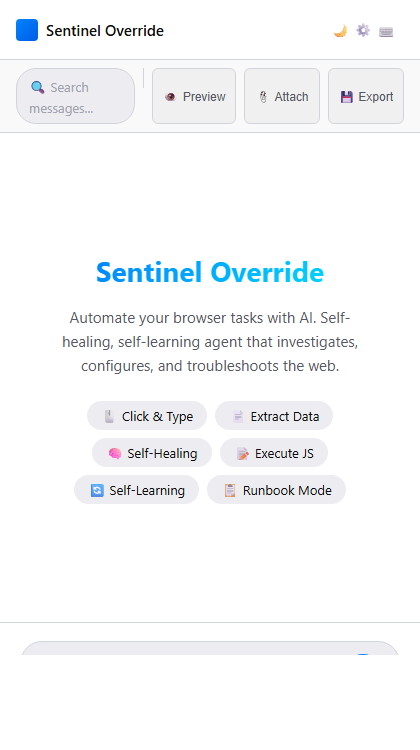
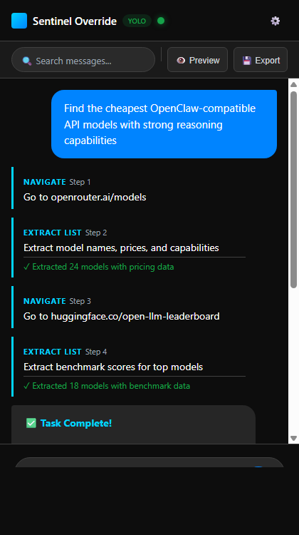

# Sentinel Override ⚡🛡️

> Professional browser automation agent. Self-healing, self-learning AI that investigates, configures, and troubleshoots the web.


## What It Does

Sentinel Override is a Chrome extension that turns your browser into an AI-powered automation agent. Tell it what to do in plain English, and it figures out how to do it — clicking buttons, filling forms, navigating sites, extracting data, even writing custom JavaScript to handle complex UI patterns.

**Built for IT professionals:** Troubleshoot M365, investigate security incidents, configure firewalls, manage user accounts — all through natural language commands.

## Screenshots

<p align="center">
  
  
</p>

*Left: Welcome screen (light mode) | Right: Agent executing a research task (Tron dark theme)*

## Features

- 🤖 **20+ Action Types** — Click, type, navigate, scroll, select dropdowns, hover, press keys, extract data, wait for conditions, run custom JS, handle iframes, dismiss overlays, and more
- 🧠 **Self-Learning** — Remembers successful task patterns and applies them to similar future tasks
- 🔄 **Self-Healing** — When an approach fails 3 times, automatically switches to a completely different strategy
- 🔍 **Extract & Remember** — Pulls data from pages and carries it between tabs (e.g., copy a user ID from page 1, use it on page 2)
- 📸 **Background Operation** — Uses Chrome DevTools Protocol to capture screenshots even when the tab is backgrounded
- 🔒 **Tab Locking** — Agent stays locked to its tab while you work in other tabs
- 📋 **Runbook Mode** — Execute structured investigation procedures step by step
- 📝 **Command Templates** — Save tasks as reusable templates with parameter placeholders
- ⏰ **Agent Scheduling** — Schedule templates to run automatically at specific times or recurring intervals
- 🤝 **Team Collaboration** — Export/import templates and reports as shareable files with safety validation
- 🔐 **Sandboxed Execution** — execute_js runs in a sandbox with blocked network/storage/chrome access
- 🎨 **Multiple Themes** — Dark mode, Matrix, Tron, Cyberpunk, Neon, Terminal, Blood
- ⚡ **Works with Any LLM** — GLM, GPT, Claude, Gemini, Ollama — anything with an OpenAI-compatible API

## Quick Start

### Installation

1. Download the latest release from [Releases](../../releases)
2. Unzip the file
3. Open Chrome and go to `chrome://extensions`
4. Enable **Developer mode** (top right)
5. Click **Load unpacked** and select the unzipped folder
6. Pin the extension to your toolbar

### Setup

1. Click the Sentinel Override icon in your toolbar
2. Click the ⚙️ Settings button
3. Enter your API endpoint and key (e.g., Z.ai, OpenRouter, OpenAI, or local Ollama)
4. Select your model
5. Start automating!

### Configuration Presets

| Provider | Endpoint | Model |
|----------|----------|-------|
| Z.ai (GLM-5.1) | `https://api.z.ai/api/paas/v4/chat/completions` | `glm-5.1` |
| OpenRouter | `https://openrouter.ai/api/v1/chat/completions` | Any OpenRouter model |
| Ollama (Local) | `http://localhost:11434/v1/chat/completions` | Your local model |
| OpenAI | `https://api.openai.com/v1/chat/completions` | `gpt-4o` |

## Usage Examples

### Basic Research
```
Find the top 10 AI headlines and give me a briefing on each
```

### IT Troubleshooting (Runbook Mode)
```
STEP 1: Navigate to admin.microsoft.com
STEP 2: Search for user "john@company.com"
STEP 3: Check license status
STEP 4: If license is missing, assign E5
Success Indicators: User has active license
```

### Data Extraction
```
Go to the company directory and extract all employee names and emails into a table
```

### Custom Automation
The agent can write and execute its own JavaScript when standard actions aren't enough. For complex UI elements (date pickers, drag-and-drop, file uploads), it automatically generates custom code to handle them.

## How It Works

1. **You describe a task** in the sidebar chat
2. **Agent observes** the current page (DOM elements, text, screenshots)
3. **AI decides** the next action (click, type, extract, wait, etc.)
4. **Action executes** with visual feedback (orange highlight on elements)
5. **Loop continues** until the task is complete
6. **Results displayed** in the sidebar with actual extracted content

## Architecture

```
sentinel-override/
├── background/
│   ├── index.js             # Service worker entry, message routing
│   ├── agent-engine.js      # Agent loop, self-healing, self-learning
│   ├── llm-client.js        # Multi-provider LLM abstraction
│   ├── scheduler.js         # chrome.alarms scheduling, port-based signaling
│   ├── template-manager.js  # Template CRUD, parameter resolution
│   ├── collaboration.js     # Import/export with safety validation
│   ├── report-generator.js  # Structured investigation reports
│   ├── tab-manager.js       # Multi-tab orchestration
│   ├── tab-context.js       # Per-tab state management
│   ├── frame-router.js      # iframe message routing
│   ├── message-protocol.js  # Typed message helpers
│   ├── provider-registry.js # LLM provider presets
│   └── shared-state.js      # Cross-module state
├── content/
│   ├── index.js             # Content script entry, action executor
│   ├── dom-utils.js         # DOM querying and manipulation
│   ├── shadow-dom.js        # Shadow DOM piercing
│   ├── dropdown-utils.js    # Complex dropdown interactions
│   ├── overlay-detector.js  # Modal/overlay detection and dismissal
│   ├── special-inputs.js    # Rich text editors, date pickers
│   ├── frame-manager.js     # iframe management
│   ├── highlight.js         # Visual element highlighting
│   ├── wait-utils.js        # Condition waiting utilities
│   └── shadow-intercept.js  # Early shadow DOM event capture
├── popup-modules/
│   ├── chat.js              # Chat interface
│   ├── settings.js          # API configuration
│   ├── templates.js         # Template library UI
│   ├── scheduler-ui.js      # Schedule management UI
│   ├── collaboration.js     # Import/export UI
│   ├── ui-common.js         # Shared UI components
│   ├── helpers.js           # Shared utility functions
│   └── popup-state.js       # Reactive state management
├── popup.html               # Sidebar UI entry
├── popup.css                # All styles (extracted)
├── popup-full.js            # UI bootstrap and orchestration
└── manifest.json            # Chrome extension manifest v3
```

## Action Reference

| Action | Description |
|--------|-------------|
| `click` | Click an element |
| `type` | Type text into a field |
| `navigate` | Go to a URL |
| `scroll` | Scroll up or down |
| `select` | Select a dropdown option |
| `hover` | Hover over an element |
| `press_key` | Press Enter, Tab, Escape, etc. |
| `extract` | Extract data to agent memory |
| `wait_for_text` | Wait until text appears on page |
| `wait_for_element` | Wait until an element exists |
| `wait_for_navigation` | Wait for URL to change |
| `execute_js` | Run custom JavaScript |
| `read_page` | Re-read page content |
| `note` | Record findings |
| `finish` | Complete task with summary |

## Security Notes

- API keys are stored locally in Chrome storage (never sent to any server except your configured API endpoint)
- The `execute_js` action runs in the content script's isolated world
- All actions can require manual approval (enable in settings)
- No data is collected or sent to any third party

## Contributing

Contributions are welcome! Please feel free to submit a Pull Request.

1. Fork the repository
2. Create your feature branch (`git checkout -b feature/amazing-feature`)
3. Commit your changes (`git commit -m 'Add amazing feature'`)
4. Push to the branch (`git push origin feature/amazing-feature`)
5. Open a Pull Request

## License

MIT License — see [LICENSE](LICENSE) for details.

## Support

If you find this useful, consider [buying me a coffee](https://buymeacoffee.com/dirtysouthalpha) ☕

---

Built with ⚡ by [Dirtysouthalpha](https://github.com/dirtysouthalpha)
